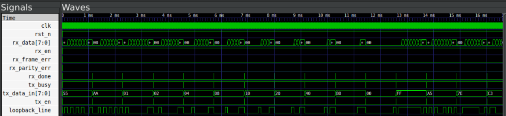

# UART Transceiver

Parameterized UART transceiver. Validated on a Renesas ForgeFPGA at 115200 baud.

Started as a basic implementation, iteratively improved by studying real hardware — added majority-based sampling, false-start recovery, and configurable parity along the way.

---

## Parameters

| Parameter | Default | Options |
|---|---|---|
| `CLOCKFREQ` | 50,000,000 | any |
| `BAUDRATE` | 9600 | any |
| `DATASIZE` | 8 | any |
| `PARITY` | `"NONE"` | `"NONE"`, `"EVEN"`, `"ODD"` |
| `STOPBITS` | 1 | 1, 2 |
| `OVERSAMPLE` | 16 | any |

---

## Architecture

```
uart
├── baud_gen
├── rx
│   ├── sampler       — majority vote + false-start detection
│   ├── sipo
│   └── parity_gen    — generate block, zero overhead if PARITY="NONE"
└── tx
    ├── piso
    └── parity_gen
```

RX FSM: `IDLE → START → DATA → PARITY → STOP → IDLE`

---

## Simulation

```bash
cd tb
bash run_all_tests.sh   # runs all unit + integration tests via iverilog
```

Each submodule has its own testbench. Full loopback test covers 14 byte patterns — alternating bits, walking ones, boundary cases, random.



---

## Run a single test

```bash
cd tb
iverilog -g2012 -I ../src -o tb.vvp ../src/*.v tb_loopback_test.v
vvp tb.vvp
gtkwave tb_loopback_test.vcd
```
